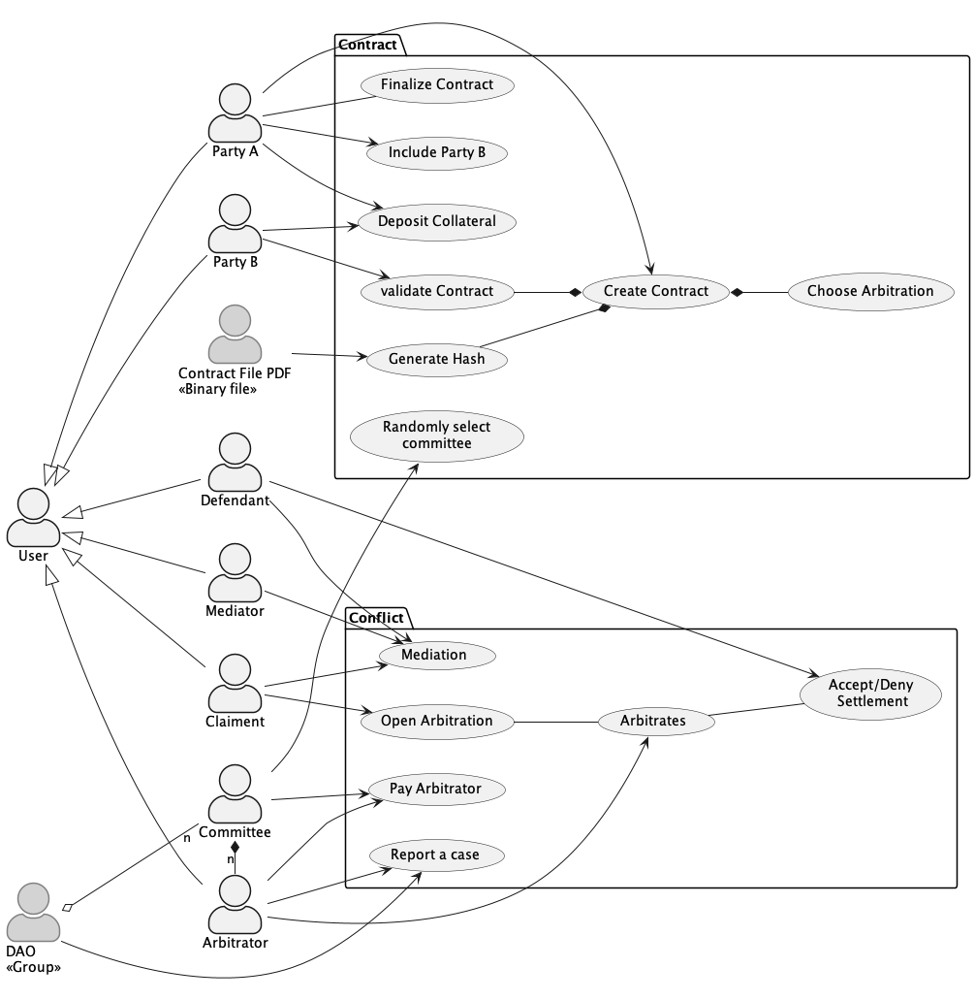
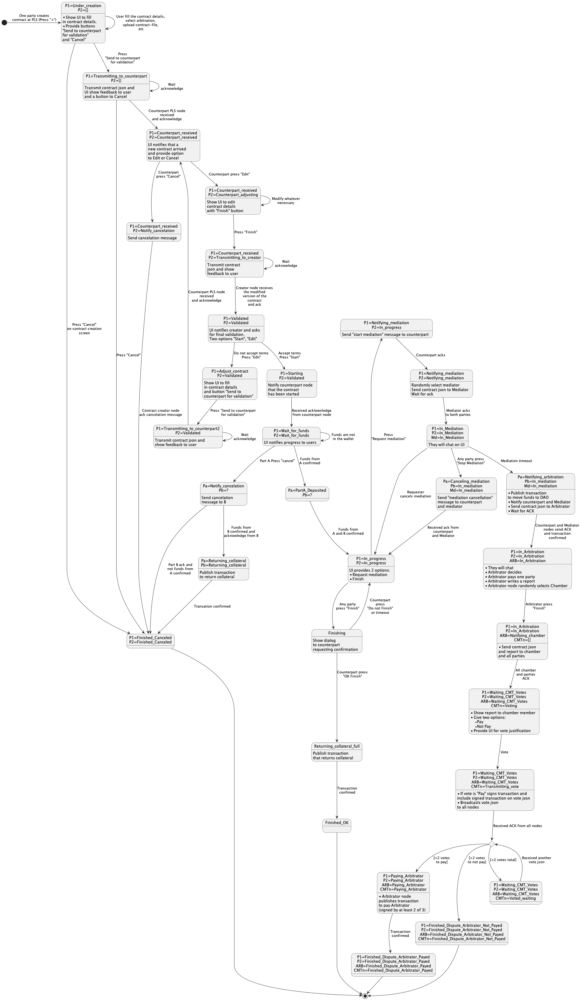

# The Free Speech Challenge - Private Law Society Proof Of Concept

- [The Free Speech Challenge - Private Law Society Proof Of Concept](#the-free-speech-challenge---private-law-society-proof-of-concept)
  - [Introduction](#introduction)
  - [How it is organized](#how-it-is-organized)
  - [UX/UI](#uxui)
  - [Simulation](#simulation)
    - [Installation](#installation)
    - [How to run](#how-to-run)
    - [What's is going on?](#whats-is-going-on)
      - [Negotiation phase](#negotiation-phase)
      - [1-Contract creation](#1-contract-creation)
      - [2-Start the contract](#2-start-the-contract)
      - [3-Start arbitration](#3-start-arbitration)
    - [Additional info](#additional-info)
      - [Local checking](#local-checking)
      - [Online Decoders](#online-decoders)
      - [Setup regtest](#setup-regtest)
      - [Library:](#library)


## Introduction
The [Free Speech Challenge](https://www.privatelawsociety.net/challenge) is a playground use case to help developing and testing PLS.
This is NOT intendend to be the PLS application. The work done here will be eventually copied or reused.
The idea is to proof the concept, consolidade ideas, warm up the team and create awareness.


## How it is organized
We divided the POC into two parts:

* UX/UI prototype: an idea of user interface for the PLS

* Simulation: a code that simulates contract creation, execution and dispute on Bitcoin regtest. The idea is to show the technical feasibility, communicate what we are trying to accomplish, train the team, and create code to be reused.

## UX/UI
The figure below depicts the main use cases to be covered by the Proof Of Concept UI:



## Simulation
### Installation
On Mac:

* Install Node: brew install node
* Install pnpm: brew install pnpm
* Install packages: pnpm install
* Install docker:
    * brew install --cask docker
    * run docker to start the service

### How to run
* Start Bitcoin node: docker run --name bitcoin-regtest -p 8080:8080 junderw/bitcoinjs-regtest-server
* Run demo: pnpm start

### What's is going on?
The sequence diagram below depicts the contract creation, execution and dispute process.


Actors:
* libwriter (Alice) : The writer
* privcomp (Bob) : The company
* PLS_libwriter : PLS App node running locally on libwriter computer
* PLS_privcomp : PLS App node running locally on privcomp computer


#### Negotiation phase
PLS is *not* a markeplace. Libwriter and Privcomp will meet somewhere else and negotiate the terms of the deal and create and exchange a contract file (PDF).

In the POC some boiler plate code is done to create the parties wallets and simulate the contract file negotiation. This is the output:
```
Part A: setting up the environment
 * Creating actor wallets
     DAO address0: bcrt1q7z9aht6ygn450wyc6zg4pydfh264mvuragrmya
     Alice address0: bcrt1q8f3ullw5egm3j0vpec2nn3ax2ek4hukyfef0tz
     Bob address0: bcrt1qsqf8jzszuhmmq886az4ta03sh9jwpa6vrhg478
 * Funding wallets >>> alice and bob singlesig address 0s funding <<<
        Balances:
                DAO balance: 280000
                alice (libwriter) balance: 40000
                bob (privcomp) balance: 40000
        -----
 
 
Part B: Negociations (happens outside PLS)
 * Libwriter and Privcomp negotiate and write a contract file (PDF) 
 
```
This is the [contract-file](docs/ContractFile.pdf).


#### 1-Contract creation
Any party, let's say libwriter, go to PLS App to create the contract. In the PLS UI the libwriter create the contract. He must:
* The other party ID/user
* Select an arbitrator and a mediator
* Provide his own public key
* Process the contract file (PDF)

The contract file (PDF) is not stored in the PLS App. The PLS App just process it to calculate a hash that unically identify the contract file.

At this stage the contract is "Configured". 

The figure below depics the contract states:


The POC output details the contract JSON at this stage:
```
Part 1: Contract creating in PLS
 * One of the parties, let's say Alice, creates the contract
 * Generates the PDF file hash and store on json
    fileHash 5e44a3c32b2ca745bdb8f39965b421a838b3eea9ed44625b439d4f091b7ba059
 * Sent contract at state "Configured" to the other party:
    contract.asJSON() {
  "state": "Configured",
  "user0Publickey": "0362abb05ed3748da977ef648833329fb0cf10bc452e2eae377fe9e6b4a6a0a87a",
  "user1Publickey": "BOBs public key",
  "mediatorPublickey": "",
  "arbitratorPublickey": "02baa1cbae12e019dc854938a01213713ad67d5638ce943311e969605df352e5b3",
  "daoPublickey": "",
  "creationDate": 1675520789610,
  "expiringDate": 1683296789610,
  "fileHash": "5e44a3c32b2ca745bdb8f39965b421a838b3eea9ed44625b439d4f091b7ba059",
  "version": "1"
}
```

After that, the libwriter "submits" the contract to privcomp. Libwriter's PLS App send a JSON file to Privcomp's PLS App detailing the contract.

Privcomp will check the contract parameters. In particular, he will process his version of the contract PDF to ensure that the hash matches. If he does not agree with the selected arbitrator or mediator, he will contact the libwriter and negotiate a different one.

When privcomp is happy with the result, he validates the contract on the PLS App. The application will change the state of the contract to "Validated" and send the json back to libwriter's node.

The POC output details the contract JSON the balances at this stage:
```
* The other party validate and finalize the configuration
    contractHash d5e2d70a6a250772b07c58a02bb2efbbcdb53fc8aca51b81c3af677d14e9396b
    contract.asJSON() {
  "state": "Validated",
  "user0Publickey": "0362abb05ed3748da977ef648833329fb0cf10bc452e2eae377fe9e6b4a6a0a87a",
  "user1Publickey": "02ab0fe557d8aabf367ff0e5af9078d72712ad2f73f0a2b2224dce7ee53b13834b",
  "mediatorPublickey": "",
  "arbitratorPublickey": "02baa1cbae12e019dc854938a01213713ad67d5638ce943311e969605df352e5b3",
  "daoPublickey": "",
  "creationDate": 1675520789610,
  "expiringDate": 1683296789610,
  "fileHash": "5e44a3c32b2ca745bdb8f39965b421a838b3eea9ed44625b439d4f091b7ba059",
  "version": "1"
}
-----
        Balances:
                DAO balance: 280000
                alice (libwriter) balance: 40000
                bob (privcomp) balance: 40000
        -----
```


#### 2-Start the contract
Libwriter validates once more the parameters. The system will not allow him to change it anymore. If he agrees with all parameters, he starts the contract. The PLS App will:
* Create a contract wallet (multisig 2 of 2)
* Transfer funds from libwriter and privcomp to the wallet
* Create a dispute transaction (T) that moves the funds to DAO
* Change the contract state to "Initiated"

The dispute transaction is created but not broadcasted. Both libwriter and privcomp has the disput transaction. If something goes wrong, anyone of them can use it to start a dispute.

The POC output details the contract wallet, the funds transfers, the dispute transation.

```
Part 2: Start contract
 * Create contract wallet (multisig 2 of 2)
    Multisig address0: bcrt1qfzx3xvlcu7g9r928zhperqya2emmdq4ds3jryhwa5mfjqdyz9glq59pq8l true
 * Alice transfers collateral into the multisig <<<
        psbt { unsignedTx: PsbtTransaction {} }
        txId c31453dbf44e6cc2ffe4180999fc125d2f45b56be0a52d4deb295ad56e4cd2d9
    alice txid: 8620c502d853fdc31a23fb84433a76db2eb47a190406508caeee85db5692c45e
    alice tx hex: 02000000000101d9d24c6ed55a29eb4d2da5e06bb5452f5d12fc990918e4ffc26c4ef4db5314c30000000000ffffffff025046000000000000220020488d1333f8e79051954715c391809d5677b682ad8464325ddda6d32034822a3e0000000000000000456a43504c533565343461336333326232636137343562646238663339393635623432316138333862336565613965643434363235623433396434663039316237626130353902483045022100c7a66975d4fe015bb96a6a820a705c4b1e39ce7455fce1946a86b74be4b2c92f022043ae879a1355ad3690194021c62dd0b947025106fe4939d6f002f48856770c430121028a3b85277e76d10ed90ea9ace22c12c21f808f95dd4216ab6e09438d5af1053c00000000
        Balances:
                DAO balance: 280000
                alice (libwriter) balance: 20000
                bob (privcomp) balance: 40000
                multisig balance: 18000
        -----
 * Bob transfers collateral into the multisig <<<
        psbt { unsignedTx: PsbtTransaction {} }
        txId 4ff0d79f72a7b569a62e73ed5d65e8329437d179eb749c43182f192733ba2b75
    bob txid: 0a1cbbdd0b436ff4e1c08361337b3e46d72e378a645c0f3bd081a69e922c11fe
    bob tx hex: 02000000000101752bba3327192f18439c74eb79d1379432e8655ded732ea669b5a7729fd7f04f0100000000ffffffff025046000000000000220020488d1333f8e79051954715c391809d5677b682ad8464325ddda6d32034822a3e0000000000000000456a43504c53356534346133633332623263613734356264623866333939363562343231613833386233656561396564343436323562343339643466303931623762613035390247304402206e437c4d97d60491e08bd4706abe7be0792a8a2fa1834e6325525ad3267253c9022028c92d8bd858244f1eae9feadd3bbd384b47bb243d9fa7ab6ce0d54653b10f8a0121035325fca9a74f207ec0c8981b9e08ca0e5b0ca49395dbb8ad12a61374baf06b7400000000
        Balances:
                DAO balance: 280000
                alice (libwriter) balance: 20000
                bob (privcomp) balance: 20000
                multisig balance: 36000
        -----
 * Creates dispute transaction from multisig to DAO <<<
        psbt { unsignedTx: PsbtTransaction {} }
        txId 8620c502d853fdc31a23fb84433a76db2eb47a190406508caeee85db5692c45e
    dispute txid: 174b49eeb3ff7eab3279a5f705260cc29709747804c37db210226d27582f3102
    dispute tx hex: 020000000001025ec49256db85eeae8c500604197ab42edb763a4384fb231ac3fd53d802c520860000000000fffffffffe112c929ea681d03b0f5c648a372ed7463e7b336183c0e1f46f430bddbb1c0a0000000000ffffffff02b888000000000000160014f08bdbaf4444eb47b898d0915091a9bab55db3830000000000000000456a43504c53356534346133633332623263613734356264623866333939363562343231613833386233656561396564343436323562343339643466303931623762613035390400483045022100e566e58eb4cb13b3f2f235a3eb4dffa7084bc5fd4eb7490efefd502e948717b2022036d4d85daea6e7514e7ea97d5d30992093214ae3c51381d6e2d552dc510fd80801483045022100d271c02768a16953150add279dd017631e4bdb1c71492e0ad6b699ff697f762b022015397ed88c76948f58397603adddc3e5f5dee2ab565b460bf3aa45656e47acbb0147522102ab0fe557d8aabf367ff0e5af9078d72712ad2f73f0a2b2224dce7ee53b13834b210362abb05ed3748da977ef648833329fb0cf10bc452e2eae377fe9e6b4a6a0a87a52ae040047304402201ecccf6a13c20b382dbbcd42b3ad7c0c60938d47a240eb672b1617bb232fe327022078ca20976a87ae6a5e628a8a06ff6ffa5accfa76d9a47ca5e18c01f6c857ea1e0147304402202ce5e51d77d02110a8faa47267ad887743a15daf55e743589dc2138a225bbb4802200492b3ddaea7c7f2dee892bf51b945d4aedd80a1ca255bb300c3a6421d4a3cfd0147522102ab0fe557d8aabf367ff0e5af9078d72712ad2f73f0a2b2224dce7ee53b13834b210362abb05ed3748da977ef648833329fb0cf10bc452e2eae377fe9e6b4a6a0a87a52ae00000000
        Balances:
                DAO balance: 280000
                alice (libwriter) balance: 20000
                bob (privcomp) balance: 20000
                multisig balance: 36000
        -----
```

#### 3-Start arbitration
Let's say that something goes wrong. The Libwriter can invote Mediation in PLS App. If mediation does not solve the issue, then he will broadcast the dispute transaction and start the arbitration. 

The mediation and arbitration process is not detailed on the sequence diagram. Summarizing, funds will be transfered to DAO wallet and the Arbitrator and the DAO Committee will work this out.

The POC output shows the balances, showing that the funds were transfered to the DAO wallet.

```
PART 3: Dispute
Any party can broadcast dispute transaction from multisig to start arbitration <<<
        Balances:
                DAO balance: 315000
                alice (libwriter) balance: 20000
                bob (privcomp) balance: 20000
                multisig balance: 0
        -----
```

### Additional info
Next subsections give some additional tools and info.
#### Local checking
Generate sha3-256 of file:

```
cat <FILENAME> | openssl dgst -sha3-256
```

Get transaction details:

```
bitcoin-cli -regtest getrawtransaction <TRANSACTION_ID> true
```

Convert Hex to Text / op_return data:
```
echo <HEX_VALUE> | xxd -r -p
```


#### Online Decoders
btc-transaction: https://www.blockchain.com/explorer/assets/btc/decode-transaction

op_return data: https://www.hextotext.com/en/convert-hex-to-text


#### Setup regtest
This docker image runs a Bitcoin node with --regtest flag (regression tests), and a rest server able to get coins from faucet or mine n blocks instantly.

```
docker run --name bitcoin-regtest -p 8080:8080 junderw/bitcoinjs-regtest-server
```


#### Library:
https://github.com/bitcoinjs/bitcoinjs-lib


